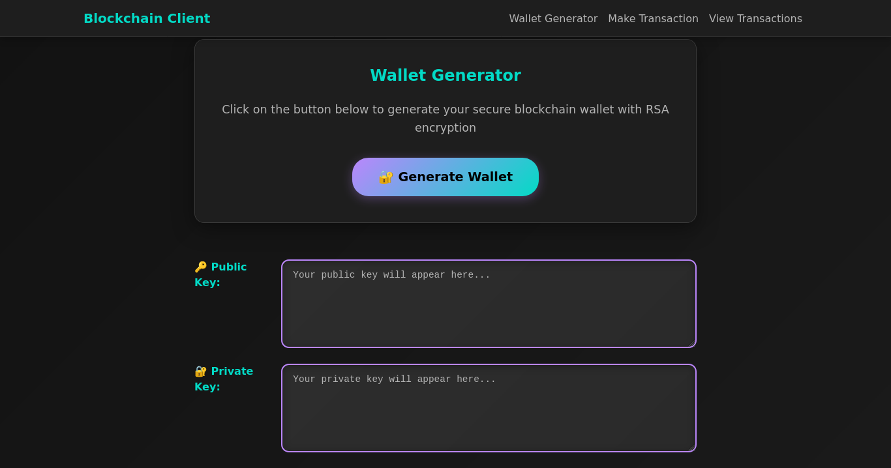

# Blockchain with FastAPI (Educational)

Source code based on the blog post: [A Practical Introduction to Blockchain with Python](http://adilmoujahid.com/posts/2018/03/intro-blockchain-bitcoin-python/), upgraded to a FastAPI backend while keeping the original blockchain logic and dashboards.

Important
---------
This project is for educational purposes only. It lacks production security, performance, and many critical features. Don’t use it on mainnet or with real funds.

Preview
-------
<div style="display:block;margin:auto;height:80%;width:80%">
  
  
</div>

What’s inside
--------------
- Proof-of-Work (PoW) blockchain with mining and simple longest-chain consensus
- Transaction signing/verification using RSA (PKCS#1 v1.5)
- Multiple nodes with peer registration and conflict resolution
- Two dashboards (Jinja2 templates):
  - Blockchain Frontend (miners): view mempool, mine, resolve
  - Blockchain Client (users): generate wallets, sign and submit transactions

Project layout
--------------
- `blockchain/main_fastapi.py` — FastAPI node app (blockchain, mining, peers, UI)
- `blockchain_client/main_fastapi.py` — FastAPI client app (wallets, signing, UI)
- `blockchain/templates` and `blockchain/static` — node UI
- `blockchain_client/templates` and `blockchain_client/static` — client UI
- `requirements.txt` — dependencies for the FastAPI setup

Requirements
------------
- Python 3.9+ recommended (tested on 3.13)

Install
-------
```
pip install -r requirements.txt
```

Run (FastAPI)
-------------
Start the node (UI at http://127.0.0.1:8000):
```
uvicorn blockchain.main_fastapi:app --host 127.0.0.1 --port 8000 --reload
```

Start the client (UI at http://127.0.0.1:8080):
```
uvicorn blockchain_client.main_fastapi:app --host 127.0.0.1 --port 8080 --reload
```

Quick guide
-----------
1) Open the client UI → http://127.0.0.1:8000
   - Generate a wallet (gets RSA public/private keys)
   - Create a transaction (it’s signed locally)
   - Submit it to the node (default http://127.0.0.1:8000)

2) Open the node UI → http://127.0.0.1:8080
   - See unmined transactions (mempool)
   - Click Mine to add a block with PoW and reward
   - Optionally configure peers and resolve to the longest valid chain

API endpoints (node)
-------------------
- GET `/` — dashboard
- GET `/configure` — peer configuration UI
- POST `/transactions/new` — add a signed transaction (form fields)
- GET `/transactions/get` — list mempool transactions
- GET `/mine` — run PoW and create a new block
- GET `/chain` — get the full chain
- POST `/nodes/register` — add peers (comma-separated)
- GET `/nodes/resolve` — adopt the longest valid chain
- GET `/nodes/get` — list peers

Notes & limitations
-------------------
- No balances/UTXO; spends aren’t validated beyond signature check
- Low PoW difficulty for demo purposes
- Simple consensus (longest chain) for illustration only


Attribution
-----------
- Original work © 2017 Daniel van Flymen
- Modified work © 2018 Adil Moujahid
- FastAPI migration, dark theme, and UI improvements © 2025 Dolphin-Syndrom
